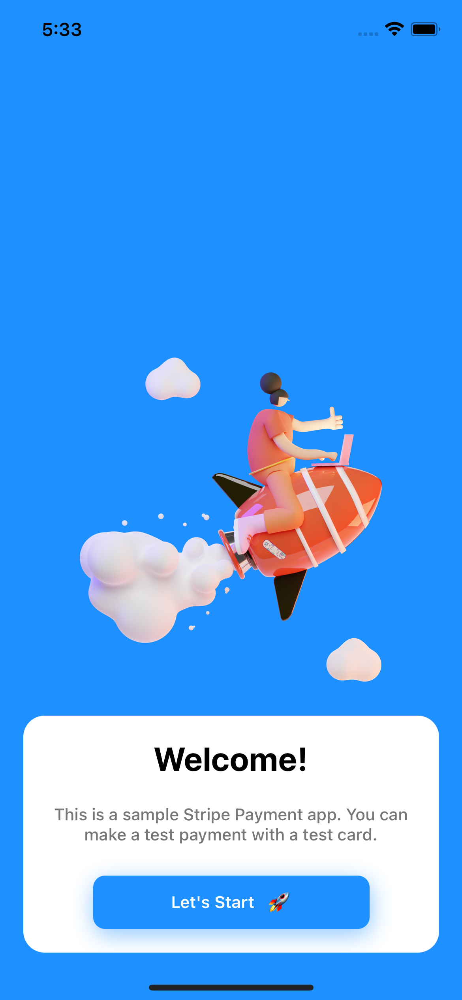
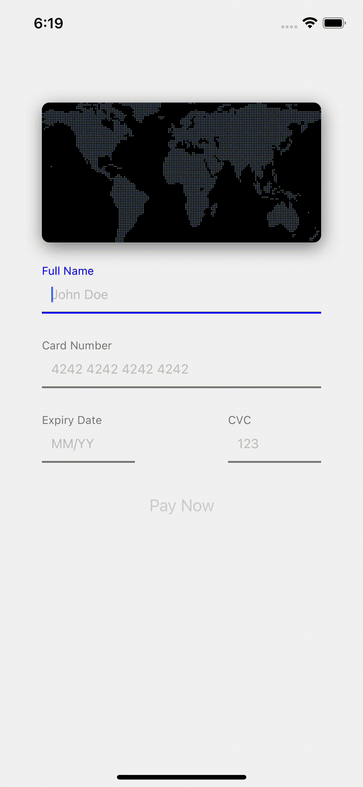

# Hi

This is a simple stripe test payment app, it only consist 2 screens and it totally made by me!

## How to test?

First you need a Stripe Account. Then you should enter your `secret_key` and `publishable_key` to `.example.env` file, then change `.example.env` to `.env`. Finally start the API and test if payment made to your Stripe account!
